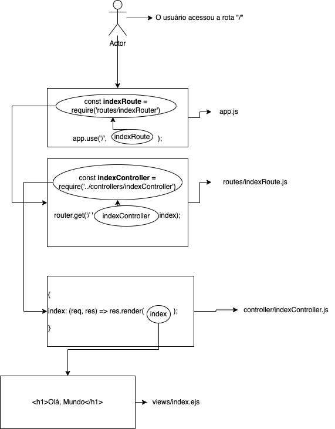

# 2023-02-09: Revisão de Express

## Passo 1 -- Inicializar o projeto

A primeira coisa que temos que fazer para criar uma aplicação em node é inicializar a pasta como um projeto.

```bash
npm init -y
```

onde: `npm init` é o comando para inicializar a pasta e o argumento `-y` dispensa o questionário para os metadados do projeto. Caso queira cadastrar os metadados do projeto, deve-se remover o `-y` e preencher as questões que aparecerão no terminal.

---
## Passo 2 -- Instalar as dependências

Para instalar as dependências, basta entrar com o comando `npm i` no terminal, seguido dos nomes das dependências que já identificamos que iremos utilizar. Agora, iremos utilizar apenas o Express e o EJS, então, instalamos essas dependências com:

```bash
npm i express ejs
````

Há algumas dependências que costumam ser instaladas como globais -- que são instaladas de uma vez só e podem ser usadas em todos os projetos desde então. Nesse caso, usa-se a flag `-G`, que significa "global". Também há como instalar dependências que serão usadas apenas enquanto está sendo desenvolvida a aplicação com a flag `-D`.

---
## Passo 3 -- Criar a estrutura básica do projeto

Na medida em que o projeto é desenvolvido, surge a necessidade de criar arquivos e pastas, mas alguns arquivos e pastas temos certeza que serão usados. É uma ideia criá0los já agora.

```
controllers/  => Pasta da camada de controllers
models/       => Pasta da camada de modelos
public/       => Pasta de arquivos estátivos
routes/       => Pasta da camada de rotas
views/        => Pasta da camada de vistas
app.js        => Arquivo do aplicativo.
```

---
## Passo 4 -- Configuração básica do arquivo `app.js`

Agora que a estrutura já está criada, vamos configurar nosso arquivo `app.js` com algumas configurações iniciais.

### Instanciar o express

A primeira que temos que fazer é importar o módulo do Express como dependência (em uma constante chamada `express`) e salvar uma instância da execução desse módulo em uma constante chamada de `app`. Esses nomes podem ser diferentes, mas eles são comuns e tradicionais e é remcomendado usá-los.

```js
// Estamos no arquivo app.js

const express = require('express'); // Importou o módulo express

const app = express(); // Guardamos a execução do módulo na variável
```

### Subir o servidor

Depois disso, vamos "subir o servidor" usando o método `.listen()` de `app`. O primeiro argumento deste método é a porta do servidor que será usada para receber os pedidos. O segundo argumento é opcional e é uma função de callback geralmente utilizada para imprimir mensagens no terminal quando o servidor é ligado com sucesso. É recomendado que essa linha seja a última linha do arquivo.

```js
app.listen(80, () => console.log('Servidor funcionando na porta 80'.))
```

# Configurar o Express

Há algumas configurações básicas que temos que fazer para o Express funcionar de maneira minimamente correta. São elas:

 - **Configurações para o manejo das informações de formulário:** Para que consigamos utilizar os dados de formulários de uma maneira compreensível, usamos essas duas configurações:

```js
app.use(express.urlencoded({extended : true}));
app.use(express.json());
```
 - **Configuração da pasta para arquivos estáticos:** Essa configuração irá informar ao `app` qual é a pasta de arquivos estáticos que será usada. Tradicionalmente, a pasta `public` que é usada para esse propósito. Nós criamos ela e vamos configurar:

```js
app.use(express.static('./public'))
```

- **Configurações da camada de vistas:** Agora, vamos criar as configurações informando qual será a view engine que iremos utilizar e qual a pasta que irá conter os arquivos da cama de view do nosso app. Nesse caso, iremos usar o EJS como view engine e iremos armazenar os arquivos na pasta `views`. A configuração fica assim:

```js
app.set('view engine', 'ejs');
app.set('views', 'views');
```

**NOTA:** É recomendado que as linhas pertencentes à seção de configuração fique após às importações.

# Entendendo o MVC

O MVC é um padrão arquitetural de projetos em programação que é muito difundido entre aplicações da web. Ele propõe separar as responsabilidades em três camadas com as seguintes funções:

- **Model:** A camada de Model irá conter toda a lógica de negócio do projeto e também irá utilizar os dados. Há duas camadas costumeiramente tidas como adjacentes à camada de Model, que são as camadas de Database (que é o banco de dados propriamente dito) e a camada de Repositório (que faz o "meio de campo" entre o Model e o Database, conectando e convertendo os métodos do banco de dados para o model).
- **View:** A camada de view irá conter as formas de apresentação dos dados ao usuário. Existe também uma pasta adjacente à camada de views, que é a pasta `public`, que é onde contém todos os arquivos estáticos da aplicação, como CSS, JS de Front-End, etc.
- **Controller:** É a ponte entre o usuário, o Model e a View. É a camada de controllers que irá fazer todo o trabalho de fluxo da aplicação, colhendo as requisições do usuário, acessando a camada de modelo para receber lógicas de negócio e dados e escolhendo a view correta para, então, exibir as informações para o usuário. Existe uma camada adjacente à camada de controllers, que é a camada de rotas. É por intermédio das rotas que o controller trafega ao longo do sistema.

No exemplo do desenho abaixo, temos um usuário que acessa a rota `/`. Essa rota está associada a uma camada de rotas chamada de `indexRoute`. A rota `indexRoute` está importada no arquivo `app.js` da seguinte maneira:

```js
const indexRoute = require('./routes/indexRoute')
```

A associação da rota `indexRoute` à rota `/` se dá por:

```js
app.use('/', indexRoute);
```

Analisando o arquivo `indexRoute.js` dentro da pasta `routes`, vemos que ele associa, por sua vez, essa rota `/` ao uso do método `index` do objeto `indexController` que é o controlador associado. O controlador é importado nesse arquivo usando:

```js
const indexController = require('../controllers/indexController);
```

E o método `index` é usado em:

```js
router.get('/', indexController.index);
```


Por fim, analsando o arquivo `indexController.js`, que está na pasta `controllers/`, vemos que ele é um objeto que contém um método chamado `index`, que é utilizado lá no arquivo de rota. Esse método contém uma função de callback própria do módulo Express, que recebe a reququisição do usuário `req` e a resposta que o usuário receberá `res`. Nessa função em específico, simplesmente, redirecionamos o usuário para receber a view chamada `index`. Assim:

```js
{
    index: (req, res) => res.render('index');
}
```

Por último, a view `index`, que foi chamada no callback do `indexController` corresponde ao arquivo `index.ejs` que está na pasta de `views/`. Ela é apenas uma tag `h1` que contém a mensagem de "Olá, mundo".




## Status

Concluído ✅

## Instruções para utilizar os arquivos

 - Acesse esta pasta pelo repositório local, em seu computador
 - Instale as dependências com `npm i`
 - Execute o arquivo `app.js` com o `node` ou o `nodemon`